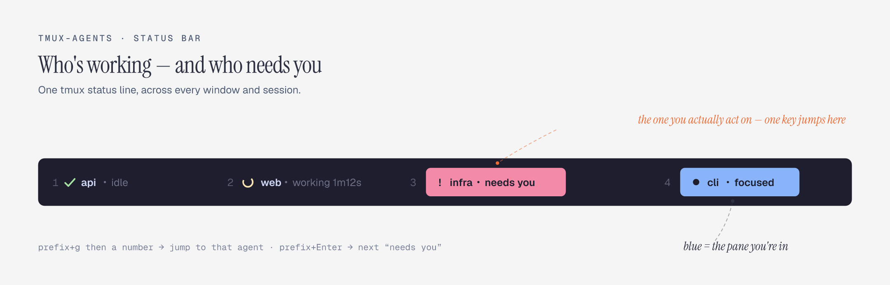

# tmux-agents

在 tmux 状态栏里常驻显示正在运行的 **AI coding agent**（Claude Code、aider、codex…），
带 **active / working / needs-you / idle** 状态，点击或弹窗即可跳到对应 pane。

一个**纯 tmux 插件**把散落在各 window / session 里的 agent 汇成一条状态栏 —— 零迁移、终端无关、可改、开源。



- **跨 window / session 可见**：不管切到哪，状态栏都列出所有 agent
- **状态准且即时**：Claude Code 通过 hooks 主动上报状态（非截屏猜测）；其它 agent 截屏兜底
- **active 跟随焦点**：你在哪个 agent，哪个高亮，不受响铃/完成干扰
- **点击跳转** + **fzf 实时预览弹窗**（撞名也能一眼分清）
- 按启动时间排序，位置稳定；同名目录自动补 pane 号；窄屏自动折叠

## 安装

**一键（不需要 TPM）** —— clone + 接入 tmux.conf + 装 Claude hooks + 重载，全干了：

```sh
curl -fsSL https://raw.githubusercontent.com/maoxiaoke/tmux-agents/main/install.sh | bash
```

装完进 tmux、新开一个 claude 会话即可。卸载：`~/.tmux/plugins/tmux-agents/scripts/uninstall.sh`。

<details><summary>不放心 curl｜bash？先看脚本再跑（推荐）</summary>

```sh
git clone https://github.com/maoxiaoke/tmux-agents ~/.tmux/plugins/tmux-agents
~/.tmux/plugins/tmux-agents/install.sh
```
</details>

---

或者按下面分步来（想用 TPM、或想清楚每步在做什么）。装两样：**For Agent**（让 Claude 上报状态）+ **插件**（把状态显示在状态栏，选「有 TPM」或「没有 TPM」）。

### For Agent — 让 Claude 上报状态

让每个 claude 把 working / needs-you / idle **主动上报**给状态栏（这是状态准且即时的关键；不配也能跑，退回截屏猜，但没这么准）。一条命令：

```sh
/path/to/tmux-agents/scripts/install-hooks.sh      # 换成你 clone 的路径
```

幂等、自动备份、保留你已有的 hook；卸载 `install-hooks.sh uninstall`。**只对之后新开的 claude 会话生效。**
> 走下面「有 TPM」并开 `@agents-auto-hooks on`，这步会自动帮你做，**不用手跑**。

<details><summary>它往 settings.json 写了什么 + 各 hook 作用（手动配 / 排查时看）</summary>

```json
{
  "hooks": {
    "UserPromptSubmit": [
      { "hooks": [ { "type": "command", "command": "/path/to/tmux-agents/scripts/claude-hook.sh working" } ] }
    ],
    "PreToolUse": [
      { "matcher": "AskUserQuestion|ExitPlanMode",
        "hooks": [ { "type": "command", "command": "/path/to/tmux-agents/scripts/claude-hook.sh needs-you" } ] }
    ],
    "PostToolUse": [
      { "hooks": [ { "type": "command", "command": "/path/to/tmux-agents/scripts/claude-hook.sh working" } ] }
    ],
    "Notification": [
      { "matcher": "permission_prompt|elicitation_dialog",
        "hooks": [ { "type": "command", "command": "/path/to/tmux-agents/scripts/claude-hook.sh needs-you" } ] },
      { "matcher": "elicitation_complete|elicitation_response",
        "hooks": [ { "type": "command", "command": "/path/to/tmux-agents/scripts/claude-hook.sh working" } ] }
    ],
    "Stop": [
      { "hooks": [ { "type": "command", "command": "/path/to/tmux-agents/scripts/claude-hook.sh idle" } ] }
    ],
    "StopFailure": [
      { "hooks": [ { "type": "command", "command": "/path/to/tmux-agents/scripts/claude-hook.sh idle" } ] }
    ]
  }
}
```

- `UserPromptSubmit` → **working**（开始干活）
- `PreToolUse` `AskUserQuestion|ExitPlanMode` → **needs-you**。**关键**：这俩是 claude 内部工具，不走权限、也不走 MCP，只能靠这个 matcher 标红。别给 `PreToolUse` 再挂无 matcher 的 working，会抢写。
- `PostToolUse` → **working**。工具跑完（= 你答完提问 / 批准权限后）立刻从红色恢复。
- `Notification` `permission_prompt|elicitation_dialog` → **needs-you**；`elicitation_complete|elicitation_response` → **working**。**matcher 不能省**，否则 `idle_prompt`（空闲 60s）、`auth_success` 会被误判成红。
- `Stop` / `StopFailure` → **idle**（正常 / API 报错结束都归位）

hook 进程继承所在 pane 的 `$TMUX_PANE`，所以知道是哪个 agent。
</details>

### 有 TPM（推荐）

`~/.tmux.conf` 加两行（放在结尾 `run '~/.tmux/plugins/tpm/tpm'` 之前），再按 `prefix + I`：

```tmux
set -g @plugin 'maoxiaoke/tmux-agents'
set -g @agents-auto-hooks on          # 顺带把上面的「For Agent」自动做了
```

> `prefix` 是 tmux 前缀键，默认 `Ctrl+b`：按一下 `Ctrl+b` 松开，再按 `Shift+i`（大写 I）。

装完状态栏右侧立刻出现 agent 列表。

### 没有 TPM

想用 TPM：`git clone https://github.com/tmux-plugins/tpm ~/.tmux/plugins/tpm`，并确保 `.tmux.conf` 结尾有 `run '~/.tmux/plugins/tpm/tpm'`，然后回到上面「有 TPM」。

不想用 TPM：`.tmux.conf` 加一行（换成你 clone 的路径），重载即可（hooks 用上面「For Agent」那条单独跑）：

```tmux
run-shell /path/to/tmux-agents/agents.tmux
```

<details><summary>自定义 agent 列表在状态栏的位置（默认最右）</summary>

放占位符 `#{agents}`，插件替换成 agent 列表：

```tmux
set -g status-right '#{agents} | %H:%M '   # 放右
set -g status-left  '#S #{agents}'         # 放左
set -g status-format[0] '#[align=left]#{T:status-left}#[align=centre]#{agents}#[align=right]#{T:status-right}'  # 居中(tmux ≥ 3.3)
```

放了占位符就按你的位置来；没放才自动挂最右（`set -g @agents-auto off` 关掉自动挂）。
</details>

## 选项

| 选项 | 默认 | 说明 |
|---|---|---|
| `@agents-auto` | `on` | 没写 `#{agents}` 占位时，自动挂到 `status-right`。设 `off` 则只认占位符 |
| `@agents-auto-hooks` | `off` | 设 `on` → 插件加载时自动装 Claude hooks（幂等、无变化不写），省掉手跑脚本 |
| `@agents-interval` | `2` | 状态栏刷新秒数（影响 spinner/时长） |
| `@agents-key` | `a` | `prefix + <key>` 唤起弹窗菜单 |
| `@agents-next-key` | `Tab` | `prefix + <key>` 切到下一个 agent（可 `-r` 连按） |
| `@agents-prev-key` | `BTab` | `prefix + <key>` 切到上一个 agent（BTab = Shift+Tab） |
| `@agents-attention-key` | `Enter` | `prefix + <key>` 一键直达 needs-you 的 agent |
| `@agents-goto-key` | `g` | `prefix + <key>` 然后按数字，直达第 N 个 agent |
| `AGENT_PATTERN` (env) | `claude\|aider\|codex\|opencode\|gemini\|cursor-agent` | 识别 agent 进程的正则 |
| `AGENT_WORKING_RE` (env) | `esc to interrupt` | 截屏兜底时「工作中」文本 |
| `AGENT_BLOCKED_RE` (env) | 见脚本 | 截屏兜底时「需要你」文本 |

## 操作

| 操作 | 行为 |
|---|---|
| 左键点状态栏里的 agent | 跳到该 pane |
| `prefix + a` / 右键状态栏 | 弹窗菜单（有 fzf 用实时预览） |
| `prefix + Tab` / `prefix + Shift+Tab` | 在 agent 间循环切下一个 / 上一个（可连按） |
| `prefix + Enter` | **一键直达需要你的 agent** —— 只在 needs-you 间跳（可连按） |
| `prefix + g` 然后数字 | **直达状态栏第 N 个 agent**（序号见状态栏，避开 `prefix+数字` 切窗口） |

## 工作原理

- **presence**：`tmux list-panes` + `ps` 找出哪些 pane 在跑 agent。
- **state**：优先读 hook store（`~/.cache/tmux-agents/hook/<pane>`，由 agent 自己写）；
  没有则截屏底部几行做兜底判断（只看 footer，避免对话正文里的同名文字误判）。
- **render**：`bar.sh` 输出带 `#[range=...]` 的可点击状态栏文本。

## 依赖

- tmux ≥ 3.0（多行/range 需 3.2+，居中需 3.3+）
- bash、coreutils（macOS/Linux 均可）
- 可选：`fzf`（实时预览弹窗）

## 卸载

一键清干净（移除 hooks + 缓存 + 运行期键位/状态栏改动，保留你已有的其它 hook）：

```sh
/path/to/tmux-agents/scripts/uninstall.sh
```

之后手动删掉 `.tmux.conf` 里的 `@plugin 'maoxiaoke/tmux-agents'`（TPM 再 `prefix + alt+u` 清目录），重载即可。

## License

MIT
