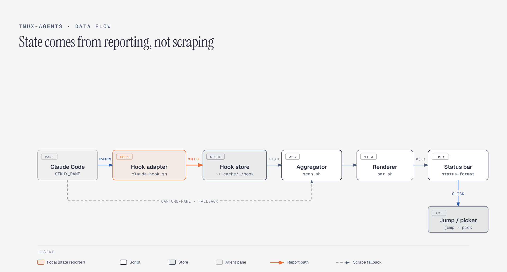
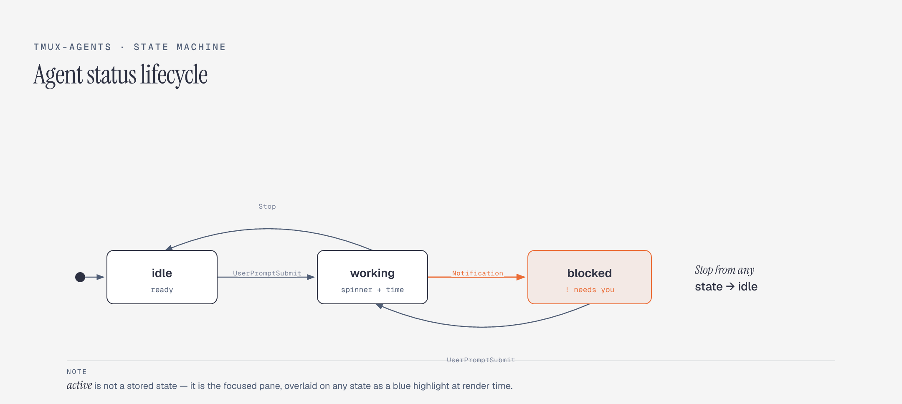

# tmux-agents 技术文档

面向贡献者 / 维护者。讲清楚它**怎么工作的**、**为什么这么设计**、**怎么扩展**。
用户安装与使用见 [USAGE.md](./USAGE.md)。

---

## 1. 设计目标与取舍

| 目标 | 取舍 |
|---|---|
| 寄生在 tmux 里，零迁移、终端无关 | 不做独立 app/daemon（那是重得多的另一条路） |
| 状态**准且即时** | 优先让 agent 主动上报（hooks），**不靠截屏猜**；截屏只做兜底 |
| 纯 shell + tmux，可改可读 | 不引入任何运行时依赖 |
| 跨 macOS / Linux | `date` / `ps` 做兼容分支 |

核心理念一句话：**presence 由 tmux/ps 决定，state 由 agent 上报决定。**

---

## 2. 架构总览



数据流分两条：
- **写状态**：agent 的 hook 进程 → hook store（事件驱动，瞬时）。
- **读+渲染**：tmux 状态栏每 `status-interval` 秒 + 每次焦点切换（`refresh-client -S`）调用 `bar.sh` → `scan.sh` 聚合 → 输出带可点击 range 的文本。

---

## 3. 组件职责

| 文件 | 角色 | 职责 |
|---|---|---|
| `agents.tmux` | 插件入口（TPM） | 把状态栏里的 `#{agents}` 占位替换成 `#(bar.sh #{pane_id})`；设刷新间隔、焦点刷新 hook、点击/弹窗键位；读 `@agents-*` 选项 |
| `scripts/scan.sh` | 聚合器 | 列出所有 pane，找出跑 agent 的，确定每个的 `status` 和 `working` 时长，输出 TSV |
| `scripts/bar.sh` | 渲染器 | 调 `scan.sh`，排序/消歧/溢出折叠/上色，输出 tmux 状态栏文本 |
| `scripts/claude-hook.sh` | Claude 适配器 | 作为 Claude Code hook 被调用，把状态写进 hook store |
| `scripts/jump.sh` `cycle.sh` `goto.sh` | 导航 | 点击跳转 / 循环 / 按序号直达，都经 `focus.sh` 切到目标 pane |
| `scripts/focus.sh` | 切换 | session 名 + `window_id` + `pane_id` 切过去（不拼字符串，空格安全） |

---

## 4. 状态模型

四个状态，**渲染时**区分（`active` 是渲染期叠加的，不进 store）：

| 状态 | 含义 | 视觉 |
|---|---|---|
| `active` | 当前客户端**聚焦**的 agent | 高亮药丸（蓝；若同时 blocked 则红） |
| `working` | 正在干活 | spinner `⠋⠙…` + 时长 `working 2m`（黄） |
| `blocked` | **需要你**（等输入/确认） | `! 名字 · needs you`（红） |
| `idle` | 空闲待命 | `✓ 名字 · idle`（绿勾 + 暗灰） |

状态由 hook 事件驱动，生命周期如下：



**判定优先级（scan.sh）**：先看 hook store；store 没有才截屏兜底。
**渲染优先级（bar.sh）**：`active` 高亮覆盖一切；其余按 store/兜底给出的 working/blocked/idle。

> `active` 为什么单独算、且只认 `#{pane_id}`？因为「聚焦」是**客户端**概念。早期版本用 `pane_active && window_active` 推断，会被 agent 完成时的**响铃**干扰（bell 让 pane 被标活动）。现在 `bar.sh $1 = #{pane_id}`（状态栏绘制时 tmux 传入的聚焦 pane），严格跟随焦点。副作用利好：`#{pane_id}` 是 `#()` 命令串的一部分，焦点一变命令串变 → tmux 立即重跑 → 高亮瞬时跟手。

---

## 5. 状态来源

### 5.1 Hook store（主，准）

- 路径：`${XDG_CACHE_HOME:-~/.cache}/tmux-agents/hook/<pane-number>`
  （`<pane-number>` = `$TMUX_PANE` 去掉 `%`，如 `%9`→`9`）
- 内容（单行 TSV）：`status \t since_epoch \t last_epoch`
  - `status` ∈ `working | needs-you | idle`
  - `since_epoch`：进入**当前状态**的时刻（用于 working 时长）
  - `last_epoch`：最后一次上报时刻
- 由 `claude-hook.sh` 写；`scan.sh` 只读。

### 5.2 截屏兜底（次，猜）

没 hook 的 agent（aider/codex…）或还没触发过 hook 的 claude，`scan.sh` 退回截屏：

```sh
footer=$(tmux capture-pane -p -t "$pid" | grep -v '^[[:space:]]*$' | tail -n 6)
```

**只看底部 6 行**，因为 claude 的工作指示/提示恒在 footer。
> 早期扫整屏导致 bug：pane 显示的对话正文里若出现 “esc to interrupt” 这几个字（比如在讨论本项目），会被误判为 working。只看 footer 后正文不再干扰。

匹配规则（可用环境变量覆盖）：
- `AGENT_WORKING_RE`（默认 `esc to interrupt`）→ working
- `AGENT_BLOCKED_RE`（默认含 `Do you want|❯ 1\.|(y/n)…`）→ blocked
- 都不中 → idle

兜底场景的 working 起始时间存在 `~/.cache/tmux-agents/scrape/<pane>`，由 `scan.sh` 维护。

---

## 6. Claude hook 适配器

`claude-hook.sh <state>` 被 Claude Code 在不同事件调用：

| Claude 事件 | matcher | 传参 | 落库 status |
|---|---|---|---|
| `UserPromptSubmit`（发消息，开始干活） | — | `working` | working |
| `PreToolUse`（claude 要问你 / 计划待批） | `AskUserQuestion\|ExitPlanMode` | `needs-you` | needs-you |
| `PostToolUse`（每次工具跑完） | — | `working` | working |
| `Notification`（需要你授权 / MCP 表单） | `permission_prompt\|elicitation_dialog` | `needs-you` | needs-you |
| `Notification`（MCP 表单答完） | `elicitation_complete\|elicitation_response` | `working` | working |
| `Stop`（一轮正常结束） | — | `idle` | idle |
| `StopFailure`（回合因 API 报错结束） | — | `idle` | idle |

> **AskUserQuestion / ExitPlanMode 只能靠 `PreToolUse` matcher 标红**：它们是 claude 内部工具，既不触发权限、也不触发 MCP `Notification`。所以「弹了多选题却不变红」的根因就是没挂这个 matcher。
> **不要给 `PreToolUse` 挂无 matcher 的 working**：会和上面的 needs-you 抢写（同一事件多个 hook 执行顺序不保证）。working 已由 `UserPromptSubmit` + `PostToolUse` 覆盖。
> **`PostToolUse` 是 needs-you 的清除者**：事件顺序 `PreToolUse(needs-you) → 用户响应 → 工具执行完 → PostToolUse(working)`，清除发生在**工具跑完那一刻**（= 用户答完）。
> **`Notification` 必须带 matcher**：`permission_prompt`/`elicitation_dialog`=needs-you；`elicitation_complete`/`elicitation_response`=working；`idle_prompt`（空闲 60s）、`auth_success` 都不是，无 matcher 会误报。
> **别用 `SubagentStop` 当主状态**：claude 的 recap/away-summary 会在主 turn 已结束后再发它，会把 idle 错误复活成 working。
> **死会话残留**：hook store 文件在 agent 退出后会残留 `needs-you`/`working`，但 scan 的 `ps` 门禁只显示仍有 agent 进程的 pane，残留文件不影响显示。

关键点：
- **pane 定位**：hook 进程继承 claude 所在 pane 的 `$TMUX_PANE`，天然知道写哪个文件。无 `$TMUX_PANE`（如自管 PTY 的多路复用器）→ 直接退出，不污染。
- **working 时长保持**：若新状态 == 旧状态，保留 `since_epoch`（否则每次 `PreToolUse`/重复 working 都会重置计时）。
- **即时刷新**：写完 `tmux refresh-client -S`，状态栏立刻更新。
- **不读 stdin 会阻塞**：claude 把事件 JSON 写到 hook 的 stdin，脚本 `cat >/dev/null` 读掉。

---

## 7. 时序示例

**(a) 一轮对话**
```
你发消息 → UserPromptSubmit hook → store=working,since=T0 → 刷新 → 状态栏 ⠿ working 0s
（每秒 status-interval 重跑 bar，时长累加：working 5s, 12s…）
claude 问你确认 → Notification hook → store=needs-you → 状态栏变红 ! needs you
你回答、claude 干完 → Stop hook → store=idle → 状态栏 ✓ idle
```

**(b) 切换焦点**
```
你切到另一个 agent pane → tmux 重绘状态栏，#{pane_id} 变 → bar.sh 收到新 FOCUS
→ 新 pane 高亮蓝药丸，旧的恢复普通样式（同一秒内）
```

---

## 8. 渲染细节（bar.sh）

- **排序**：按 `start_epoch`（agent 进程启动时间）升序 → 位置稳定，不随状态变化跳动。
- **同名消歧**：先统计 `cwd` basename 次数；撞名的追加 pane 号 `apps#0.2`。
- **spinner**：`frames[ now % 10 ]`，用 bash **数组**索引（不能用 `${str:i:1}` 字节切片，多字节会断）。
- **时长**：`fmt()` → `45s` / `2m` / `1h3m`。
- **溢出折叠**：按 `client_width` 估预算；`working/blocked/active` 必显，多余的 `idle` 折叠成 `+N ✓`。
- **可点击**：每段包 `#[range=user|<num>]…#[norange]`，`<num>` 是 pane 号纯数字（避开 `%` 与 strftime 的 `%H` 冲突）。

### 点击如何跳转
`agents.tmux` 绑定：
```tmux
bind -n MouseDown1Status if-shell -F "#{m:[0-9]*,#{mouse_status_range}}" \
  "run-shell 'jump.sh #{mouse_status_range}'" \
  "switch-client -t ="
```
点到 agent 区域 → `mouse_status_range` 是数字 → 调 `jump.sh`；点到窗口列表等 → 数字不匹配 → 走默认 `switch-client -t =`（不破坏原生点窗口）。

---

## 9. 性能与刷新

- 每个刷新周期：`tmux list-panes` 1 次 + 每个 pane `ps -t` 1 次；**只有没 hook 的 pane** 才额外 `capture-pane`。hook 让 claude 跳过截屏，是主要省开销点。
- 刷新来源：`status-interval`（默认 2s，影响 spinner/时长 tick）+ 焦点切换 hook（`refresh-client -S`）+ claude-hook 写完的主动刷新。
- `#()` 输出被 tmux 按 `status-interval` 缓存；`#{pane_id}` 作为参数变化时缓存键变 → 立即重跑。

---

## 10. 跨平台注意

| 点 | macOS / BSD | Linux / GNU |
|---|---|---|
| lstart→epoch | `date -j -f '%a %b %e %T %Y'` | `date -d` |
| `ps -o lstart=` | 支持 | 支持 |
| `${#str}` 计数 | UTF-8 locale 下按字符 | 同 |

`scan.sh` 的 `to_epoch()` 先试 BSD 形式失败再试 GNU。

---

## 11. 扩展：新增一个 agent 适配器

两条路：

1. **有 hook/状态机制的 agent（首选，像 claude）**：写一个 `<agent>-hook.sh`（或复用 `claude-hook.sh` 的形式），在该 agent 的事件里把 `working/needs-you/idle` 写进 hook store。`scan.sh` 自动认。
2. **没有 hook 的 agent**：把它的进程名加进 `AGENT_PATTERN`，并按它的 TUI 调 `AGENT_WORKING_RE` / `AGENT_BLOCKED_RE`。走截屏兜底。

> store 格式与 pane 定位是通用契约，任何能拿到 `$TMUX_PANE` 的适配器都能复用。

---

## 12. 已知限制

- 截屏兜底的状态判定是**启发式**，依赖 agent TUI 文案，版本变了要调正则。
- 只追踪**直接跑在 tmux pane** 里的 agent；自管 PTY 的工具（agent 不在 tmux pane 里）看不到，那类工具自己管。
- session/window 名含空格：已用 `focus.sh`（session 名 + `window_id` + `pane_id`，不拼字符串）解决。
- hook store 文件在 agent 退出后会残留（很小、pane id 不复用，无害；可加 SessionEnd 清理）。
- 居中布局依赖自定义 `status-format`，tmux 需 ≥ 3.3。

---

## 13. 目录

```
agents.tmux                 # TPM 入口
scripts/
  scan.sh                   # 聚合（presence + state + 时长）
  bar.sh                    # 渲染
  claude-hook.sh            # Claude 状态上报
  jump.sh cycle.sh goto.sh  # 导航（点击 / 循环 / 按号）
  focus.sh                  # 切到目标 pane（空格安全）
  install-hooks.sh uninstall.sh  # 装/卸 hooks
docs/
  ARCHITECTURE.md           # 本文
  USAGE.md                  # 用户文档
```
